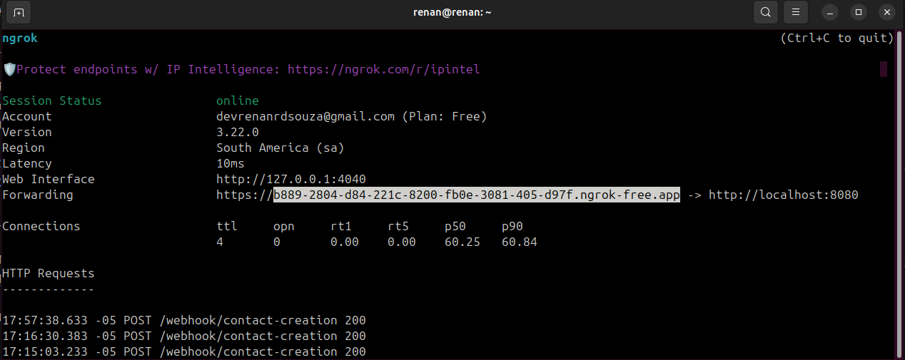

Antes de iniciar a aplicação, é necessário ter o Java 21 instalado e configurado na sua máquina.
- Também é necessário criar uma conta de desenvolvedor no Hubspot e criar um aplicativo na plataforma.
- Após isso, no painel da sua conta de desenvolvedor, crie uma conta de testes de desenvolvedor. Ela será utilizada quando acessar a url de autorização gerada.
- Crie um webhook para o seu aplicativo, para isso, acesse o seu aplicativo e clique na aba de **Webhooks** e depois clique em **Create Subscription(Criar assinatura)**.
- Na tela de criação de assinatura, selecione o tipo de objeto **Contact(Contato)** e o evento **Created(Criado)**.
---
No projeto, existe um arquivo *docker-compose.yml* que deve ser utilizado para subir alguns contêineres com o Kafka, Zookeeper e o kafdrop para visualizar as mensagens que estão sendo enviadas para o Kafka.
Para isso, é necessário ter o Docker instalado e configurado na sua máquina.
Para subir os contêineres, execute o seguinte comando na pasta raiz do projeto:
```
docker-compose up -d
```
---
### Configuração do ambiente
Antes de iniciar a aplicação é necessário configurar o ambiente com as variáveis de ambiente necessárias.
Para isso, clique em Edit Configurations como nas imagens de exemplo abaixo e adicione as variáveis de ambiente necessárias que são:
```
    HUBSPOT_CLIENT_ID=<seu_client_id>; (pode obtido no hubspot)
    HUBSPOT_CLIENT_SECRET=<seu_client_secret>; (pode obtido no hubspot)
```


Após executar os passos anteriores, inicie a aplicação.
___
Para testar o fluxo do webhook, assumindo que a aplicação está sendo rodada localmente, é necessário utilizar uma ferramenta como o **ngrok** ou
o **LocalTunnel** para expor de forma pública o servidor.
Siga os passos dos links abaixo para instalar e configurar o ngrok ou o LocalTunnel:
- [ngrok](https://ngrok.com/download)
- [LocalTunnel](https://localtunnel.github.io/www/)

Exemplo utilizando o ngrok:

1. Pegue o endereço gerado pela ferramenta junto com o caminho do endpoint, por ex: https://78f5-2804-d84-221c-8200-e620-ab0b-f42d-bed0.ngrok-free.app.app/webhook/contact-creation
2. Na sua conta do Hubspot, procure pelo seu aplicativo e na seção de *Webhooks* do seu aplicativo, insira a url de destino.

___
Na aplicação, o Spring Security foi implementado de forma básica, apenas para fins didáticos e alguns endpoints estão protegidos, como por exemplo o endpoint de criação de contato **(/contacts)**.
Portanto, quando a aplicação for iniciada, é gerado um usuário padrão(que sempre é **user**) e uma senha que pode ser recuperada no console conforme imagem abaixo.

O tipo de autentiçação utilizada é o **Basic Auth** e ela deve ser selecionada na aba **Authorization** do Postman.

No projeto existe uma pasta chamada **postman** que contém uma coleção de requisições para facilitar os testes.
